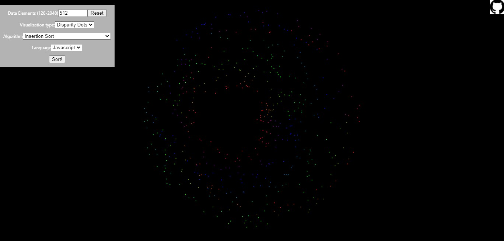

# Sort Algorithm Visualizer

In general, sorting algorithms take an array of numbers, usually integers, and sort them in ascending(or descending) order.

This project is a web-app that visualizes 12+ common sorting algorithms using 1 and 2 dimensional data. It uses several different and interchangeable methods for data visualization.


| Example of merge sort | Example of dual pivot quick sort | Example of tim sort | Example of radix sort |
| :-------------------: | :------------------------------: | :-----------------: | :-------------------: |
| <video controls = "true"> <source src ="./examples/mergesort.mp4" type = "video/mp4"/></video>|<video controls = "true"> <source src ="./examples/dualquicksort.mp4" type = "video/mp4"/></video>|<video controls = "true"> <source src ="./examples/timsort.mp4" type = "video/mp4"/></video>|
<video controls = "true"> <source src ="./examples/radixsort.mp4" type = "video/mp4"/></video>|

## Table of contents

- [Visualization Types](#Visualization-Types)
  - [2D](#2D)
    - [Scatter Plot](#Scatter-plot)
    - [Swirl Dots](#Swirl-dots)
    - [Disparity Dots](#Disparity-dots)
  - [3D](#3D)
- [Algorithms](#Algorithms)
  - [Summary](#Summary)
  - **Insertion Family**
    - [Insertion sort](#Insertion-sort)
    - [Binary insertion sort](#Binary-insertion-sort)
  - **Merge family**
    - [Merge sort](#Merge-sort)
  - **Selection family**
    - [Selection sort](#Selection-sort)
    - [Heap sort](#Heap-sort)
    - [Ternary heap sort](#Ternary-heap-sort)
  - **Exchange family**
    - [Quick sort](#Quick-sort)
    - [Dual pivot quick sort](#Dual-pivot-quick-sort)
  - **Non-comparison family**
    - [Counting sort](#Counting-sort)
    - [Radix sort(base 4)](#Radix-sort)
  - **Hybrid family**
    - [Tim sort](#Tim-sort)
    - [Intro sort](#Intro-sort)
- [References](#References)

### Visualization-Types

### 2D
- [Scatter plot](#Scatter-plot)
- [Swirl dots](#Swirl-dots)
- [Disparity dots](#Disparity-dots)

#### Scatter plot

Scatter plots use cartesian coordinates to plot data. The data's value is plotted to the y axis and the data's index is plotted to the x axis.


Random data (left) | Sorted data (right) |
| :-------------:  | :-----------------: |
|||

#### Swirl dots

Swirl dots use polar coordinates to plot data. The data's values is plotted as a function of the radius and the data's index is plotted as the angle.

Random data (left) | Sorted data (right) |
| :-------------:  | :-----------------: |
| |                      |

#### Disparity dots

Disparity dots don't use a traditional coordinate system to plot data. The data's position, along the radius of the polar coordinate system, are plotted as the difference between their
current position in the data array and the correct position in the sorted array. The data's position, along the angle of polar of the polar coordinate system is given by the data's index in the array.


Random data (left) | Sorted data (right) |
| :-------------:  | :-----------------: |
|  | |

### 3D

In progress.

### Algorithms

#### Summary

| Algorithms | Time Complexity | Space Complexity | Auxiliary Space Complexity |Stable | Approximate runtimes(2048)|
| ---------- | :-------------: | :--------------: | :------------------------: | :----: | :-----------------------: |
| Insertion sort | O(n^2)      | O(n)| O(1) | Yes | 139ms |
| Binary insertion sort | O(n^2) | O(n) | O(1) | Yes | 293ms |
| Merge sort | O(nlog(n)) | O(n) | O(1) | Yes | 15ms |
| Selection sort | O(n^2) | O(n) | O(1) | No | 226ms |
| Heap sort | O(nlog(n)) | O(n) | O(1) | Yes | 5ms |
| Ternary heap sort | O(nlog(n)) | O(n) | O(1) | Yes | 9ms |
| Quick sort | O(n^2) | O(n) | O(1) | No | 7ms |
| Dual pivot quick sort | O(n^2) | O(n) | O(1) | No | 6ms |
| Counting sort | O(n+ k), k = possible values in array | O(n) | O(n+k) | Yes | 2ms | 
| Radix sort | O(nk) k = radix base | O(n) | O(n+k) | Yes | 11ms |
| Tim sort | O(nlog(n)) | O(n) | O(1) | Yes | 13ms | 
| Intro sort | O(nlog(n)) | O(n) | O(1) | Yes | 6ms |

### Insertion Family

#### Insertion sort

Pseudocode: 

``` 
insertionSort(A):
  for i = 1 to length(A):
    let key = A[i]
    let j = i
    
    while(j > 0 and A[j-1] > key):
      A[j] = A[j-1]
      j--
     
     A[j] = key
  
```
#### Binary insertion sort

Pseudocode:

``` 
binaryInsertionSort(A):
  for i = 1 to length(A):
    let key = A[i]
    let j = i
    
    let pivot = binarySearch(A[0:j], key)
    while(j > 0 and j >= pivot):
      A[j] = A[j-1]
      j--
    
    A[j] = key
    
binarySearch(A, value):
  let pivot = length(A)/2
  
  if(A[pivot] === value) return pivot
  if(A[pivot] < value) binarySearch(A[pivot+1:length(A)])
  if(A[pivot] > value) binarySearch(A[0:pivot])
```

### Merge family

#### Merge sort

Pseudocode:

``` 
mergeSort(A):
  let pivot = length(A)/2
  mergeSort(A[0:pivot])
  mergeSort(A[pivot:-1])
  
  return mergeA[0:pivot], A[pivot:-1])
  
```

### Selection family

#### Selection sort

Pseudocode:

``` 
selectionSort(A):
  for i = 1 to length(A):
    let min = i
    
    for j = i+1 to n:
      if(A[j] < A[min]):
        min = j
    
    if min != i :
      swap(A[min], A[i])
  
```

#### Heap sort

Pseudocode:

```
heapSort(A):
  buildMaxHeap(A)
  sort(A)

buildMaxHeap(A):
  for i = length(A)/2 -1 to 1:
    heapify(A, length(A), i)

sort(A):
  for i = length(A) - 1 to 1:
    swap(A[0], A[i])
    heapify(A, i, 0)
    
heapify(A, size, i):
  let largest = i
  let left = 2*i + 1
  let right = 2*i + 2
  if(left < size and A[left] > A[largest]):
    largest = left;
  if(right < size and A[right] > A[largest]):
    largest = right;
  if(largest != i):
    swap(A, i, largest)
    heapify(A, size, largest)
```

#### Ternary heap sort

Pseudocode:

``` 
ternaryHeapSort(A):
  buildMaxHeap(A)
  sort(A)

buildMaxHeap(A):
  for let i = n/3 to 0:
    ternaryHeapify(A, length(A), i-1)
    
sort(A):
  for i = length(A)-1 to 1:
    swap(A[0], A[i])
    ternaryHeapify(A, i, 0)

ternaryHeapify(A, size, i):
  let largest = i
  let left = 3*i + 1
  let middle = 3*i + 2
  let right =  3*i + 3
  
  if left < size and A[left] > A[largest]:
    largest = left
  if right < size and A[right] > A[largest]:
    largest = right
  if middle < size and A[middle] > A[largest]:
    largest = middle
  if(largest != i):
    swap(A[i], A[largest])
    ternaryHeapify(A, size, largest)
  
```

### Exchange family

#### Quick sort

Pseudocode:

```
quickSort(A):
  if length(A) <= 1: return
  
  pivot = partition(A) 
  
  quickSort(A[0:pivot])
  quickSort(A[pivot:-1])

partition(A):
  let pivot = choosePivot(A)//  choose a pivot using some algorithm/heurisitic
  
  let i = 0
  for j = 1 to length(A)-1:
    if(A[j] < pivot):
      i++
      swap(A[j], A[i])
      
  swap(A[i+1], A[-1])
```

#### Dual pivot quick sort

``` 
dualQuickSort(A):
  pivot1, pivot2 = partition(A) //choose two pivots and swap as necessary 
  
  dualQuickSort(A[0:pivot1])
  dualQuickSort(A[pivot1:pivot2])
  dualQuickSort(A[pivot2:-1])


partition(A):
  
```

### Non-comparison family

#### Counting sort

#### Radix sort(base 4)

### Hybrid family

#### Tim sort

#### Intro sort


### References

- Cormen, Thomas H., et al. **Introduction to algorithms**. MIT press, 2009.
- Eberly, David. **3D game engine design: a practical approach to real-time computer graphics**. CRC Press, 2006.


<!-- # Getting Started with Create React App

This project was bootstrapped with [Create React App](https://github.com/facebook/create-react-app).

## Available Scripts

In the project directory, you can run:

### `yarn start`

Runs the app in the development mode.\
Open [http://localhost:3000](http://localhost:3000) to view it in the browser.

The page will reload if you make edits.\
You will also see any lint errors in the console.

### `yarn test`

Launches the test runner in the interactive watch mode.\
See the section about [running tests](https://facebook.github.io/create-react-app/docs/running-tests) for more information.

### `yarn build`

Builds the app for production to the `build` folder.\
It correctly bundles React in production mode and optimizes the build for the best performance.

The build is minified and the filenames include the hashes.\
Your app is ready to be deployed!

See the section about [deployment](https://facebook.github.io/create-react-app/docs/deployment) for more information.

### `yarn eject`

**Note: this is a one-way operation. Once you `eject`, you can’t go back!**

If you aren’t satisfied with the build tool and configuration choices, you can `eject` at any time. This command will remove the single build dependency from your project.

Instead, it will copy all the configuration files and the transitive dependencies (webpack, Babel, ESLint, etc) right into your project so you have full control over them. All of the commands except `eject` will still work, but they will point to the copied scripts so you can tweak them. At this point you’re on your own.

You don’t have to ever use `eject`. The curated feature set is suitable for small and middle deployments, and you shouldn’t feel obligated to use this feature. However we understand that this tool wouldn’t be useful if you couldn’t customize it when you are ready for it.

## Learn More

You can learn more in the [Create React App documentation](https://facebook.github.io/create-react-app/docs/getting-started).

To learn React, check out the [React documentation](https://reactjs.org/).

### Code Splitting

This section has moved here: [https://facebook.github.io/create-react-app/docs/code-splitting](https://facebook.github.io/create-react-app/docs/code-splitting)

### Analyzing the Bundle Size

This section has moved here: [https://facebook.github.io/create-react-app/docs/analyzing-the-bundle-size](https://facebook.github.io/create-react-app/docs/analyzing-the-bundle-size)

### Making a Progressive Web App

This section has moved here: [https://facebook.github.io/create-react-app/docs/making-a-progressive-web-app](https://facebook.github.io/create-react-app/docs/making-a-progressive-web-app)

### Advanced Configuration

This section has moved here: [https://facebook.github.io/create-react-app/docs/advanced-configuration](https://facebook.github.io/create-react-app/docs/advanced-configuration)

### Deployment

This section has moved here: [https://facebook.github.io/create-react-app/docs/deployment](https://facebook.github.io/create-react-app/docs/deployment)

### `yarn build` fails to minify

This section has moved here: [https://facebook.github.io/create-react-app/docs/troubleshooting#npm-run-build-fails-to-minify](https://facebook.github.io/create-react-app/docs/troubleshooting#npm-run-build-fails-to-minify)

-->
